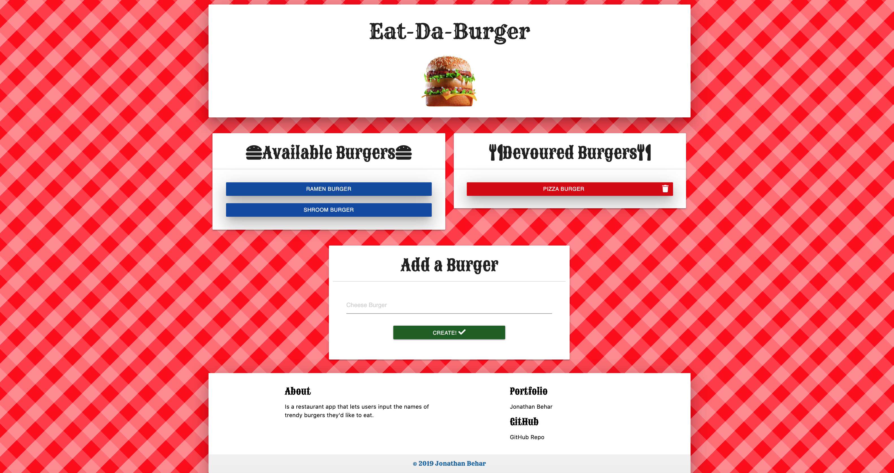

# SequelizedBurger

Creating a sequelize the Burger app that I made last unit. We've split this exercise into three different tiers, all with different tasks and expectations. Finish whichever tier will provide you with the most reasonable challenge.

## Demo

Enter or pick the burger you want and then eat it! [Here](https://jdb443-sequelize-burger-app.herokuapp.com/) is the App!

## Technology Used

### Tech

- HTML/CSS
- Materialized
- Javascript
- jQuery
- MySQL
- JawsDB
- api and ajax
- ORM frameworks
- Sequelize
- Heroku

### Node Packages

- Node - Version 13.1.0
- NPM - Version 6.13.1
- dotenv - Version 8.0.0
- express - Version 4.17.1
- expresss-handlebars - Version 3.1.0
- mysql - Version 2.17.1
- mysql2 - Version 2.1.0
- sequelize - Version 5.21.3
- nodemon - Version 2.0.2

### Deployed App

https://jdb443-sequelize-burger-app.herokuapp.com/
